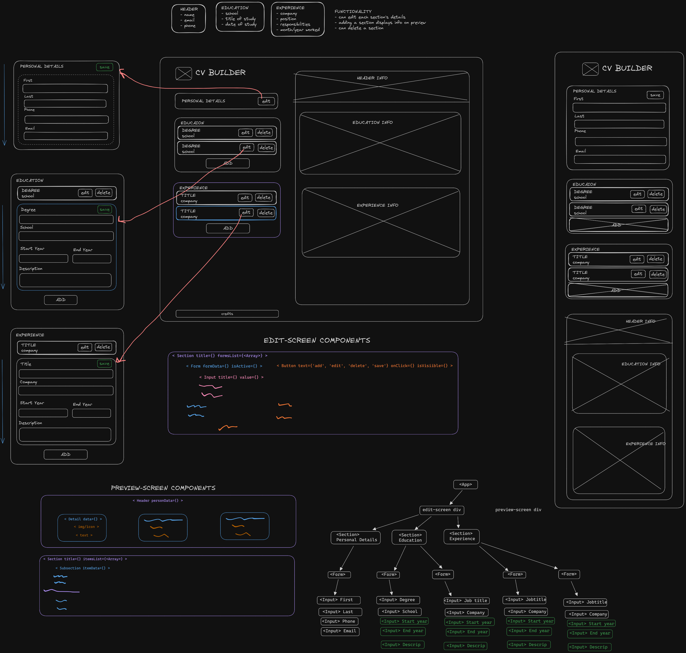

# CV Application Generator

[Live Demo](https://musical-swan-ac0937.netlify.app/)

## Purpose

Practice working with React states and props.

## Planning and Wireframes

Here is the plan I made to figure out what that basic layout of the app looks like and how the various components interact:

